# Local MVP Workflow

## Purpose

The first usable version of India Algo Platform is a **local research and paper-trading workbench**. Its job is to let a user choose one security or a small watchlist, test an approved strategy with controlled parameter revisions, compare reproducible results and run only the selected revision in local paper mode.

The purpose is not to find a “best strategy” automatically or to claim that historical results will repeat. It is to make strategy research transparent, repeatable and easy to inspect before any cloud or live-execution decision.

## What the user does locally

| Step | User action | Platform responsibility | Safety boundary |
|---:|---|---|---|
| 1 | Choose one equity or a small watchlist | Resolve the actual India-market instrument, exchange segment and session | No guessed symbols or hard-coded tokens |
| 2 | Select a strategy template | Load a versioned strategy interface and show the allowed parameter fields | No arbitrary code execution or in-place strategy mutation |
| 3 | Adjust parameters | Create a parameter **draft** and validate ranges/relationships | A dashboard edit is not a deployed setting |
| 4 | Run a backtest | Store the strategy version, parameters, dataset/version, dates and cost assumptions as one immutable experiment | Results display all assumptions and do not claim future profitability |
| 5 | Compare experiments | Compare like-for-like result IDs for the same security, period and assumptions | Do not compare mismatched data windows or hidden costs |
| 6 | Select a reviewed result | Create a paper-deployment revision from an identified experiment | Only reviewed revisions can reach paper mode |
| 7 | Run local paper trading | Simulate order, fill, position, P&L and risk events on the local machine | Paper mode only; no real broker order path |
| 8 | Review evidence | Inspect data freshness, risk decisions, paper events, logs and outcome | Stop, revise or repeat; no automatic promotion to live trading |

## First active market scope

The first working loop focuses on **selected NSE cash equities**. The underlying domain will remain ready to represent NFO/MCX contracts later, but options, futures and commodities will not block delivery of the cash-equity research and paper workflow.

This allows the user to begin with a single selected security, then expand to a small watchlist when the workflow and data-quality checks are working as expected. A bigger universe is not automatically better; it increases data, selection-bias and comparison complexity.

## Parameter revision workflow

Strategies such as moving-average crossover, RSI mean reversion, MACD or Supertrend can expose parameters in the local interface. Examples include moving-average windows, signal thresholds, lookback periods and risk settings. The interface should make adjustment simple, but the stored research process remains strict.

```mermaid
flowchart LR
    A[Choose strategy] --> B[Create parameter draft]
    B --> C[Validate ranges and relationships]
    C -->|Valid| D[Create immutable backtest specification]
    C -->|Invalid| B
    D --> E[Run reproducible backtest]
    E --> F[Store result, assumptions and trade events]
    F --> G[Review and compare result IDs]
    G --> H[Create local paper deployment revision]
```

A parameter draft must not overwrite a previous result. For example, if a user changes two moving-average periods, that creates a new revision and a new experiment. The user can then compare the two result IDs fairly, with their date range, data source, cost assumptions and trade logs visible.

## Backtest result view

The initial local result screen should show the following, with every display tied to an experiment ID:

| Category | Information shown |
|---|---|
| Research input | Security/watchlist, strategy version, parameter revision, data source/version, period and exchange session rules |
| Execution assumptions | Initial capital, cost model, slippage model, trade timing and forced-close policy |
| Outcome | Equity curve, trade log, drawdown, exposure, win rate, average trade, profit factor and risk-adjusted metrics where valid |
| Quality checks | Data quality status, no-look-ahead check, missing-data warnings, parameter validity and reproducibility status |
| Decision | Research-only, needs review, paper-eligible or rejected—never a “guaranteed profitable” label |

## Local paper mode

Local paper mode is the next validation step after research review. It should use the same strategy and risk contracts as future execution but create **only simulated events** on the local machine.

The local dashboard must show the selected strategy revision, paper state, current data freshness, open simulated positions, paper order/fill events, realised/unrealised P&L, policy blocks and a safety console. The safety console can freeze new entries, cancel working paper orders or request a simulated flattening operation. Each action must be durably logged and visibly reconciled.

## What is deliberately deferred

The first local MVP does not require cloud deployment, a multi-broker layer, live broker credentials, real orders, options-chain execution, an AI chat assistant, automatic optimization across many securities or a public-facing React application. Those capabilities can be evaluated later once the local user workflow has produced reliable research and paper-trading evidence.

## Cloud and live gates

Cloud hosting is a later operational step, not a requirement to test a strategy. Once local research and paper behavior are stable, a cloud **paper-only** environment can be used to validate service restarts, persistence, access control, monitoring and data freshness. Live trading remains a separate future decision requiring broker, security, risk and compliance approval.

This is research and analysis only, not personalized financial advice.
