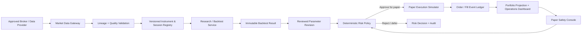
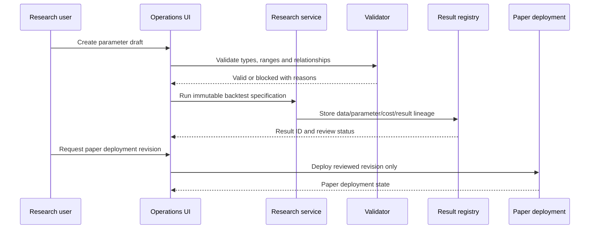

# MVP Blueprint: Broker Data to Paper Operations

## MVP purpose

The first MVP is not a live trading application. It is a local-first, paper-only platform that demonstrates the end-to-end control flow needed before real execution can be considered: trusted data ingestion, reproducible research, adjustable yet versioned strategy parameters, deterministic risk, simulated lifecycle events and an operations dashboard.

## Product flow

## MVP modules

| Module | Responsibility | Explicit non-goal for MVP |
|---|---|---|
| `packages/domain` | Typed contracts for instruments, data observations, strategy configs, proposals, risk decisions, orders, fills and audit events | Direct broker SDK calls |
| `services/market-data` | Source-aware historical/quote ingestion, quality checks, cache and data lineage | Silent fallback for paper risk/execution inputs |
| `services/research` | Backtest specifications, strategy execution against approved datasets and result registry | Claiming any strategy is profitable |
| `services/risk` | Deterministic position/limit/session/freshness checks | LLM or dashboard override of a block |
| `services/paper-execution` | Paper orders, simulated fills, event ledger, projections and recovery scenarios | Real broker order submission |
| `apps/operations` | Dashboard for data health, experiment lineage, parameter review, paper order state and safety commands | Local calculation alternatives that bypass the services |
| `tests` | Contract, replay, integration, failure and UI/API consistency tests | Tests requiring live providers or credentials |

## Parameter-adjustment workflow

The dashboard may let a user edit a draft, but it cannot mutate a deployed strategy. A deployment always references a reviewed parameter revision and immutable backtest result.

## Paper-only safety console

The safety console presents three different actions: **freeze entries**, **cancel working paper orders** and **flatten paper positions**. Each requires an explicit server-side command, durable audit event and state progression. The screen shows command acceptance and reconciliation rather than instantly declaring success.

| Safety command | State transition | Required evidence |
|---|---|---|
| Freeze entries | `ACTIVE → ENTRY_FROZEN` | Actor, reason, policy version, request timestamp and command ID |
| Cancel orders | `WORKING → CANCEL_REQUESTED → CANCELLED/FAILED` | Per-order result and reconciliation time |
| Flatten positions | `OPEN → EXIT_REQUESTED → PARTIAL/FILLED/FAILED` | Price-source label, fill events, scenario assumptions and portfolio projection |

## Local-to-cloud preparation

The MVP runs locally using fixtures and approved research/paper datasets. Its services and configuration are designed so the same contracts can later run in containers with a managed database and background jobs. The first cloud deployment should be a **paper-pilot environment**, not live execution. The future live boundary remains a distinct service requiring its own broker, security, compliance and operational approvals.

## MVP acceptance scenarios

| Scenario | Expected result |
|---|---|
| Broker-data source unavailable for historical research | Clearly labelled fallback or controlled failure according to the dataset policy |
| Data stale for a paper risk decision | Risk service returns `DEFER` or `REJECT`; no paper order enters the simulator |
| Invalid fast/slow moving-average parameters | Validator blocks the revision before a backtest starts |
| A strategy result lacks reproducible data/cost assumptions | It cannot become paper-eligible |
| A paper fill occurs | Event ledger produces order/fill/position/P&L projections with correlation IDs |
| Persistence/ledger is unavailable | Platform enters `DEGRADED` and blocks new paper orders |
| Freeze command is issued | New entries are rejected while current positions remain visible |

This is research and analysis only, not personalized financial advice.
